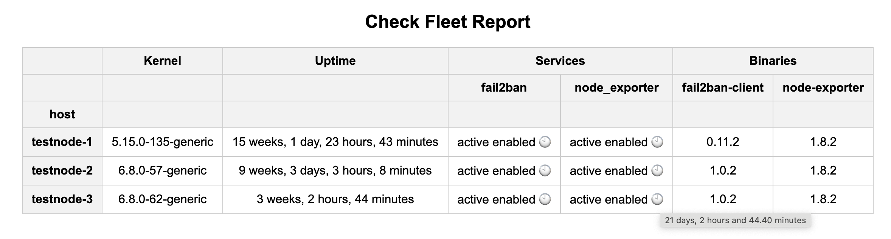

# Common Operations Ansible Collection

[](https://galaxy.ansible.com/ui/repo/published/firstset/common_operations/)
[](https://opensource.org/licenses/MIT)

An Ansible collection that provides common operations for managing various resources in a consistent manner.

## Features

### Extract key information from a list of nodes

For each node, you can define the following variables:

```
test-node:
  # a list of systemd units
  systemd_services_to_check:
    - fail2ban
    - node_exporter
  # a dictionary that records the binary name, path, and the option used to print its version information
  binaries_to_check:
    fail2ban-client:
      path: /usr/bin/fail2ban-client
      option: -V
    node-exporter:
      path: /usr/local/bin/node_exporter
      option: --version
```

Here is an example of the playbook.

```yml
- hosts: all
  become: true
  gather_facts: false

  tasks:
    - name: check fleet
      include_role:
        name: firstset.common_operations.common
        tasks_from: check_fleet.yml

    # use the following approaches to print the report,
    # or refer to the plugin firstset.common_operations.report documentation for a better report
    - name: Output report
      debug:
        msg: "{{ host_report.split('\n') }}"

    - name: Output report to a file
      become: false
      copy:
        content: "{{ host_report }}"
        dest: "./host_report_{{ inventory_hostname }}.txt"
      delegate_to: localhost
```

If the plugin `firstset.common_operations.report` is enabled, a HTML report page will be opened by the default browser.


